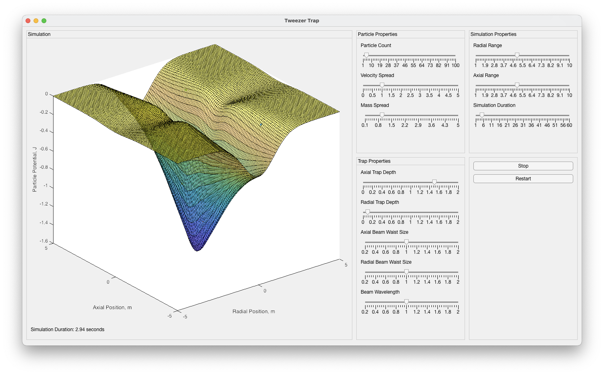

# Optical-Tweezer-Trap

## Introduction

Optical tweezers are a powerful tool in the manipulation of microscopic objects, receiving widespread recognition with the 2018 Nobel prize, as well as wide ranging application in disciplines from biology to quantum optomechanics. By using a tightly focused beam the tweezers are able to trap and manipulate all kinds of objects, from micron sized particles [1] to single atoms [2]. In this project a 2D trap was simulated, allowing the user to modify the properties of the trap and particle properties and visualise the resulting dynamics.

## Simulation Overview

The simulation allows the user to observe the dynamics of a system of particles in the potential of the beam array. The array of beams is in a 2D plane with the beams orthogonal, one along a radial axis and the other along the axial axis. The beams can be varied in their intensity (which is proportional to the relative trap depths), as well as their waist sizes and the wavelength of both beams. The user is also able to vary the number of particles, as well as the variance in their masses and initial velocity components. Additionally the user can vary the visualised range for both the radial and axial dimensions, alongside the duration of the simulation, which proceeds to loop over this duration. Finally the user can stop and start the simulation and restart it. It should be noted that modifying any of the simulation parameters requires the dynamics to be re-evaluated, for this revaluation a new random arrangement of particles is generated.

The simulation is run by executing the main.m file, with the tweezerApp function making up the core function of the simulation. The simulation typically runs smoothly on the desktop version of Matlab with a standard 8 core processor for particle numbers less than 30, with some lag increasingly appearing beyond this point. When running on Matlab Online more lag is typically present, however this has not been seen to be consistent. The lag in the simulation arises from calls of the drawnow command, which updates the figure with the new particle positions, the actual computation of the dynamics is a one off time cost of typically 0.02 seconds per 10 simulated particles.

## References
[1] A. Ashkin. Acceleration and trapping of particles by radiation pressure. Phys. Rev. Lett., 24:156–159, Jan 1970.

[2] Nicolas Schlosser, Georges Reymond, Igor Protsenko, and Philippe Grangier. Sub-poissonian loading of
single atoms in a microscopic dipole trap. Nature, 411:1024–7, 07 2001.
